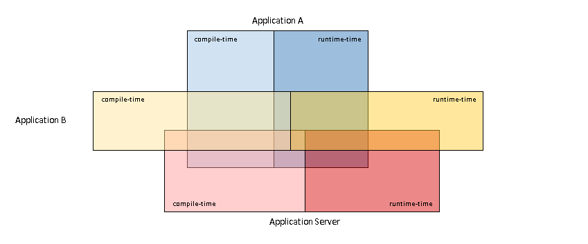
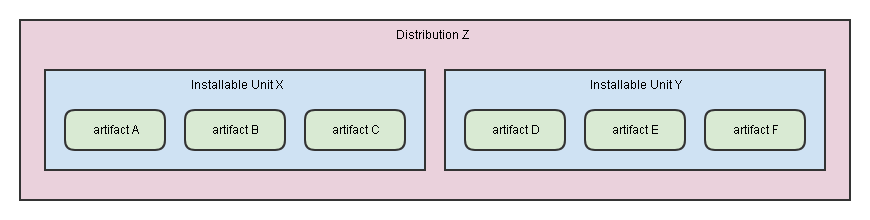
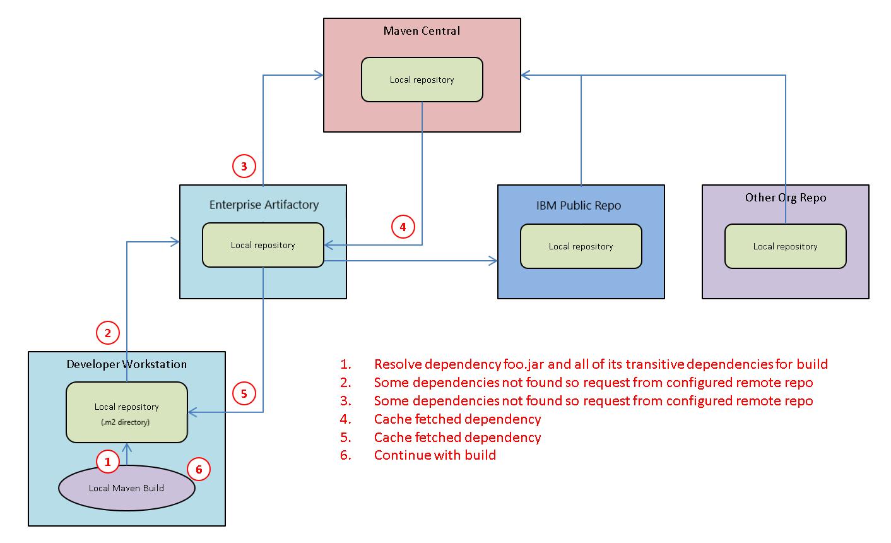
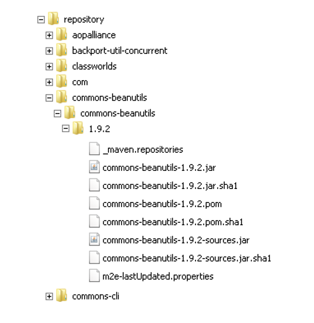
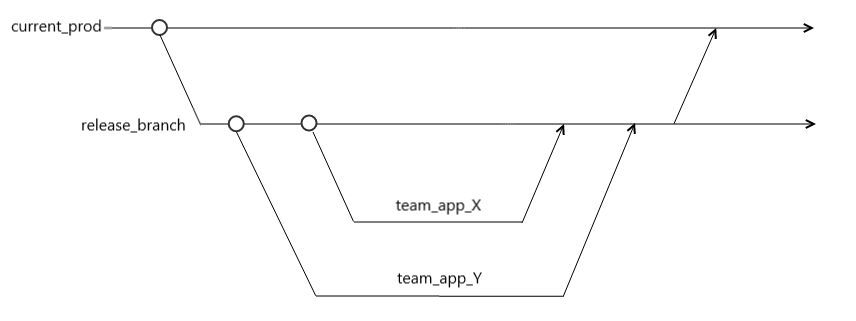
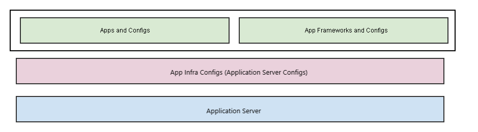
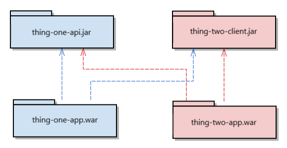
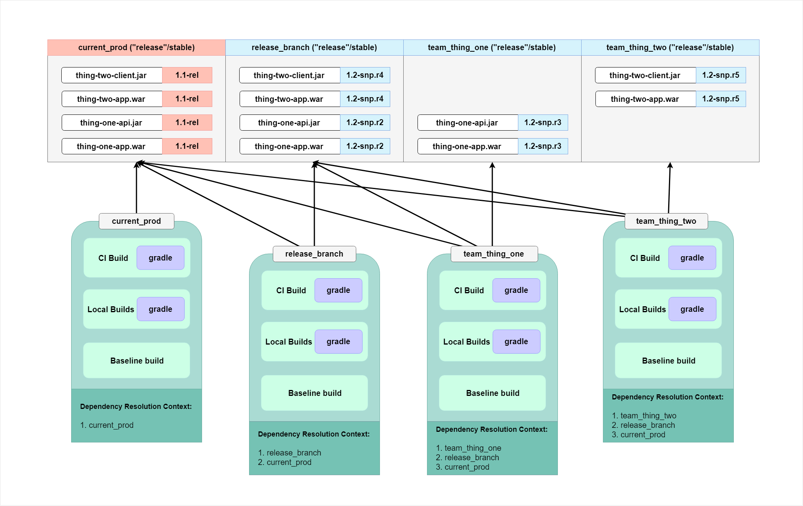

# Dependency Management Primer

 

## Monolithic Applications 

While microservice architecture may offer logistical improvements for large development teams, legacy environments are 
monolithic in nature. To understand the challenges of the legacy environment, first we need to understand 
monolithic systems. When we say monolithic in this sense we mean:

_Lifecycle of the whole is a function of lifecycle of the parts._

In this type of architecture, the individual components cannot be added/removed dynamically. Often a change to one 
component may require a restart of the entire system. This also applies to component versions. Version of the whole is a 
function of version of the parts. A new component version may require a new build of the entire system. In contrast, with 
micro architecture, component lifecycles are independent and the system as a whole can dynamically change in a production 
environment as its components are added or removed. Microservice architecture prescribes this type of composition as do 
standards like OSGI. (The debate between micro vs monolithic design is nothing new. For some CS history see the Tanenbaum 
vs Torvalds debate of the 90s: http://www.oreilly.com/openbook/opensources/book/appa.html)

#### Monolithic Dependencies

All applications have dependencies. Software is a collaborative activity which requires us to share our thoughts and 
understanding in the form of code. Our systems are made up of our code plus the dependencies we add. An application's 
dependencies can be categorized as

1. **Compile-time:** explicit dependencies which are added via Java import statements in the code
2. **Run-time:** dependencies which are loosely coupled and can be switched out at runtime

Dependencies are added at compile time via static-linking or at runtime via dynamic-linking. Managing dependencies 
from static linking is fairly straight forward. Complexity arises from dynamic linking when we _share dependencies_. Shared 
dependencies can cause side effects to other system components which are outside of your control. This is the super glue 
which ties different applications together into the monolith. Changes to shared dependencies can cause critical errors in 
other applications, which might not be discovered until they are in production.

The below diagram represents a Java based application server and 2 applications (application A, application B).

Each overlap represents different shared dependencies which can result in different runtime exceptions related to 
classloading. Now consider an environment with hundreds of applications.

Java application servers allow us to build both microservices or monolithic applications. The JVM is 
designed for these different use cases but without tools for explicit dependency management and explicit versioning, 
this is very difficult to manage.

## Artifacts, Dependencies, and Transitives

The advent of repository managers has had a big impact on the development pipeline. If nothing else, there has been a 
formalization for versioned output of a repeatable build process. In general, formalization allows us to streamline 
processes and is the cornerstone of real collaboration (I produce X, you take X as input and produce Y). One of the core 
concepts in this modern development environment is the artifact. An artifact is a versioned building block of an 
application which results from a repeatable build/package process. An artifact is published to an artifact 
repository/repository manager for other codebases to consume/depend on. A **GAV coordinate** is used to uniquely identify 
an artifact. It is comprised of:

  * **G: groupId** - hierarchical, dotted context for the artifact. Similar to a Java package. Will translate to the parent 
  directory structure in the artifact repository.
  * **A: artifactId** - artifact name, unique within the groupId
  * **V: version** - declared version number. Usually dotted, numeric (ex: 1.2.3). Most artifact repositories will create 
  version directory under the groupId directory to keep different version of the artifact separate.

To write non-trivial software, most of the time you will eventually need to depend on other peoples code. At the artifact 
level, we do this through **dependencies**. Your artifact can depend on any number of other artifacts by declaring so 
using a GAV coordinate in its build file (ex: pom.xml, build.gradle) and your build technology should support this type of 
model to make use (ex: gradle, maven, ivy). Dependencies can have their own dependencies as well. Dependencies of my 
dependencies are called **transitive dependencies**. 

The  process from build to deploy goes through many phases. For example:  
generate code -> run static analysis -> compile -> unit test -> package, etc. Each phase can require different sets of 
dependencies. The phase in which a dependency is needed is called the dependency scope. When declaring a dependency, a 
**dependency scope** should also be provided. Examples of dependency scopes can be compile, test, runtime, etc.

To maintain software, (versioned) dependency chains must be resolved and any inconsistency should cause a failure. 
Additionally, we want automatic/tool supported resolution of dependency chains. We will refer to the act of pulling 
all necessary dependencies and their transitives into the working environment as resolving the dependency chain. For the 
build, this process can be seen as pulling all dependencies and transitives and adding them to the classpath.

## Artifact Versioning and Integrating with Other Codebase

A general rule of thumb for development with other teams is that we want to

_Integrate with external code via built artifacts, not by downloading their source code._

We may not always have the luxury of acquiring access to an external organizations source code repository. In order to 
scale development and ensure accountability (for what teams build and processes around that), we should treat external 
development groups as external organizations. While our dependencies are going through development cycles of their own, 
we may require integration with specific versions of them. First we'll start by trying to define what a version of an 
artifact is.

_**Versioning** is the assignment of an artifact and its metadata to a GAV coordinate._

This metadata allows the repository to resolve artifacts differently based on what type of version is needed for 
development. "In-flight" changes and "previously released" represent different types of versions of an artifact. There are 
2 types of versions a project can depend on:

1. **Stable** ("release") - immutable with respect to a GAV coordinate
2. **Unstable** ("snapshot") - mutable with respect to a GAV coordinate. Translates to "get me the latest artifact given 
this GAV". This is achieved by the repository server by automatically appending revision numbers when an artifact is 
published to a snapshot repo.

Stable vs unstable has nothing to do with number of issues or bugs in the software. It is purely a way to articulate 
immutability of the artifact. A stable version can be riddled with bugs while an unstable version can be virtually bug free. 

## Artifact Types

Previously we defined an artifact as a "versioned building block" of an application, but specifically, what does that 
mean? An artifact is actually any thing we want it to be. At one level, it can be configuration files or binaries which 
are created by compiling source code (see Base Artifacts). At another level it can be an aggregation of those existing 
artifacts. We can try to generalize into the following 3 categories:

1. **Base Artifacts:** Built from source, meaning the input (source code/config files/scripts/etc.) comes from our source code 
repositories. In some cases, this can aggregates other base artifacts
2. **Installable Units:** Aggregations of other artifacts (could be our existing base or external artifacts). Installable unit 
is just an organizations standardized aggregate artifact along with metadata which can be installed/deployed
3. **Distribution:** An aggregation of installable units built for a target environment

_**All artifacts are versioned output of reproducible builds_

Some base artifacts can be:

* JAR files
* WAR files
* EAR files
* Configuration files
* Configuration JARs
* Scripts

The concept of standardized versioned artifacts is the key here. Once we decompose our system into standard artifacts, 
we have the ability to innovate around the creation, composition, deployment, and promotion of them.

## The Role of the Artifact Repository

Now for the logistics. Declaring dependencies is a good start, but where can we find these physical dependencies? What 
happens when a dependency can't be found? Many different organizations publish artifacts. How do we fetch these artifacts?

Usually artifact repositories do not exist in isolation but rather an ecosystem of repositories. The ecosystem is 
hierarchical and each repository is a node in the ecosystem. Remote and local repositories can be specified at each node, 
whether it is an organizations repo or simply a local development cache. Caching should occur implicitly and dependency 
chain resolution occurs in this cache. What this means is that if an artifact is not present locally, it is fetched from 
a remote repo, cached locally, then processing can continue. In a developer environment, it is the job of the build tool 
to manage the local cache. This process can be seen in the below figure:

### What does an Artifact Repository look like?

* Hierarchical structure (tree/directory)
* Dotted group id translates to directory path (each part is a directory)
* Version id is a directory at the leaf of the group id/artifact id
* Version directories hold binary artifacts and metadata files

The below example represents these concepts:

## Scaling for Large Development Teams

Developing across many teams is hard enough, but within a monolithic system, there are some unique integration challenges. 
In the artifact versioning section, we stated that we wanted to integrate with external code via built artifacts (stable 
or unstable). This is because:

_It is impractical for me to check out and build all source code for all artifacts._

We know these artifacts will come from the artifact repository in some way, but where specifically? Development of these 
artifacts occurs somewhere in a branch/stream of the source code repository. Since these branches will be the ones 
delivering (via automated CI builds) these artifacts, our repository structure may have some overlap with our branching 
strategy. Some important questions which we need to answer are:

* Where does code change?
* Where is code integrated?
* Where does code become stable/immutable?
* Where does code become unstable/mutable?

An over simplified view of our branching strategy is as follows:

**A release_branch serves as the last integration point for code being tested in QA on its way to production. 
A 'team_X' branch is a specific team's branch where members integrate their code before being deployed to their test environment.

We can make the following observations about this kind of environment:

1. Builds should be consistent and run in any environment.
2. Each branch may not have code for all artifacts required (Ex: compile-time dependencies) for its development or runtime 
environment. This is by design. The alternative would be high physical space requirements and more duplication.
3. Each branch delivers its built artifacts via an automated CI build to an artifact repo in the ecosystem
4. Code from specific branches will be deployed/installed on specific environments.
5. There is only 1 version of a stable artifact in the repo ecosystem.
6. There can be multiple conflicting versions of an unstable artifact (in the repo ecosystem) delivered from different branches. 
These conflicting versions are valid and must be kept separately. Once code gets integrated into integration/release branches, 
these conflicts will get resolved.
7. A working development (or runtime) environment includes artifacts which were coded in your branch + stable or unstable 
artifacts outside of your control (remember integration occurs by pulling other peoples built artifacts, not by pulling their code).
 
One of the first questions in this environment is:

_If all artifacts are not present in the branch for compilation, where do we get these artifacts from?_

We can probably figure out that the artifact repo is one place to look for these artifacts since that is where they are 
published, however as a result of #6 above, the next question is:

_How do I further qualify the artifacts when there are multiple conflicting unstable versions?_

For large development teams, dependencies are resolved across many different branches or repos. To operate in this environment, 
a build must cascade from a list of repositories to locate the relevant artifact/JAR. We can refer to the cascading over 
multiple repos until the artifact is located as Cascading Dependency Resolution (CDR). The list of relevant repositories 
is a subset of all repositories in the ecosystem and ordering represents precedence 
for a specific environments build. The ordered list of configured repositories will be referred to as the build's Dependency 
Resolution Context (DRC). The DRC can be different for different environments. We will use these formal definitions to 
provide a solution which can operate consistently across development and server environments.

## The Current Challenges

Many groups help deliver different parts of monolithic applications. These groups include Ops, application 
infrastructure, and application development teams. The different parts are deployed/installed at different locations on 
a target machine. One way to break up our deployment into layers is as follows:

Currently we are focused on the green boxes. This directory is pre-built/composed for a specific release and represents 
a snapshot of all application level artifacts and configs at specific versions. 
What those versions are and how/where the artifacts were pulled is hidden from developers. For such an important phase 
in environment setup, the question is: _Why is it hidden?_

Let's look at some development environment issues reported by the legacy code based dev community (some of these are on a project per 
project basis and depend on complexity):

* Inability to develop locally 
* Inconsistent development and server environments
* Lack of development automation
* Developer IDE lock-in
 

If we let these issues distill, we will be left with some underlying issues which can help us unhide what we might have 
previously thought was too complicated:

1. No explicit _versioned_ dependency management
2. Lack of command line tools to support different environments (ex: development)

### Explicit Versioned Dependency Management

Without first having dependency management, we can not systematically decompose or compose our system. The composition of 
our system must take cascading dependency resolution with the appropriate dependency resolution context into account.
When developers don't have the power to compose their system in a repeatable fashion, they come across issues like:

* Prevented from re-building/re-composing locally if their resolution context differs from the pre-built version. Teams 
resolve this by manually copying JARs to appropriate location or are required to check out the codebase of those 
dependencies. Manual processes create many inconsistencies and create risk from the environment differences.
* even within the same resolution context, JAR files can be updated as external team in-flight changes 
are delivered to release branches. At this point it becomes a manual activity to fetch new JARs and copy 
to your local environment

These problems are exacerbated when explicit versioning is not available. Dependency 
management with a CDR solution helps us define/share/leverage the full dependency graphs in the correct context in order to 
build the system for any environment. The ability to autonomously develop locally starts here.

### Command Line Tools

Currently some environment setup is provided via IDE plugins and UI driven flows. Without any deeper dive, its already 
apparent that this approach creates vendor lock-in. What may not be apparent is that any process which requires button 
clicks is, by definition, already a manual process. Automation occurs at the code and command line level since this allows 
teams to programmatically (whether in full languages or scripting) perform multiple tasks. Any future solution must be 
command line driven but if we can additionally leverage tools/languages which are platform agnostic, we can help address 
the "inconsistent development and server environments" complaint from developers as well. A few relevant tools/languages 
in this space are: groovy/gradle/maven.

## Case Study: Multiple Teams Sharing Unstable Dependencies

The lack of process automation to support the development environment causes dev teams to find manual work-arounds and 
can result in added development time and integration bugs based on inconsistencies. The following was an actual development 
scenario which probably is not uncommon:

Once upon a time, App_X shared a few JARs with App_Y. App_Y used some value objects classes, and App_X also used App_Y's client JARs. 
When App_X was working on a project that would require changes on both apps, App_Y would email App_X JAR changes, and App_X would send 
them their changes. App_X would then take App_Y's JAR changes and place them in the App_X test environment and App_Y would do the same in their 
workspaces until the changes were finally pushed to the mainline so that the JAR could be obtained.

The easiest solution is to attribute this to a training issue but there may be hidden developer use cases which current 
environments do not support. For example, one solution is for the team to attach their dev team_X stream to the team_Y stream 
of the other team. However, we'll state again from the artifact versioning section:

_We want to integrate with external code via built artifacts, not by downloading their source code_

Since the maturity of artifact repositories, this is how large development teams in the industry operate. We want to treat 
other teams like external organizations and promote independence/auditability/accountability. Promoting accountability 
means teams should ensure quality and mature their own CI/CD pipeline to deliver regular stable and unstable artifacts 
which are unit and integration tested. We can define 2 types of roles for teams building/using artifacts:

1. **Contributor:** I will be checking in changes to source code and build the resulting artifacts
2. **Consumer:** I only need to leverage the functionality of the artifact (not checkin or build)

In the modern environment, a consumer should not need intimate details about building or testing from source (Remember 
that everyone must be able to build locally, not simply run the server build).

Back to our original scenario. We can model the artifact dependencies like the below diagram:

The cross domain arrows above represent scenarios where the teams exchanged built JARs over email. Obviously sharing JARs 
via email presents a risk, but if there was a solution provided by the development environment, I'm sure they would have 
been happy to leverage it. A more industry standard solution involves using the artifact repository to share these JARs, 
making this auditable (I know which version of the dependency I'm building against), consistent and secure. It will involve:

* Building an artifact repository structure that will isolate the different stable/unstable artifacts
* Setting up the appropriate DRC (Dependency Resolution Context) for the CI builds and local development environments 
for consistency
* Delivering the artifact from the CI build to the appropriate repo

In the above diagram let's observe the following:

* Last stable release to production for all JARs is 1.1 (1.1-rel).
* Current development (unstable/in-flight) is on version 1.2. Revision numbers are pictured above to show where different changesets are delivered.
* The release_branch repo represents changes that have been merged/integrated into the release_branch/stream. 
* CI builds publish the artifacts to the associated artifact repo.
* Dependency Resolution Contexts should be externalized from the build and configured for the environment (CI and local build should match).

The usecase from the original scenario was to share unstable/snapshot JARs between the 2 teams. This could be done in 2 ways and would result in a different configured resolution context:

1. Pull snapshot jars which have been merged/integrated into the release_branch
 - resulting jars pulled in for build:
    * thing-one-api-1.2-snp.r3.jar
    * thing-one-app-1.2-snp.r3.jar
    * thing-two-client-1.2-snp.r4.jar
    * thing-two-app-1.2-snp.r4.jar

2. Pull latest snapshots from external teams repo area
 - resulting jars pulled in for build:
    * thing-one-api-1.2-snp.r3.jar
    * thing-one-app-1.2-snp.r3.jar
    * thing-two-client-1.2-snp.r5.jar
    * thing-two-app-1.2-snp.r5.jar
  
## End Goal

The following are high level goals for this effort:

1. Dependency management implemented for all legacy projects. (gradle).
2. All artifact metadata/descriptors/configs generated from gradle build.
3. Artifacts resolved via CDR (cascading dependency resolution) from Artifactory.
4. Functioning local build with unit tests and code coverage reports.
5. Implemented as command line tools which could be leveraged in any environment.
 