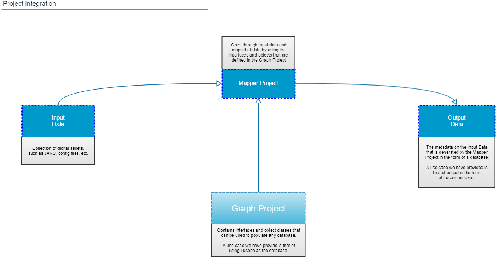
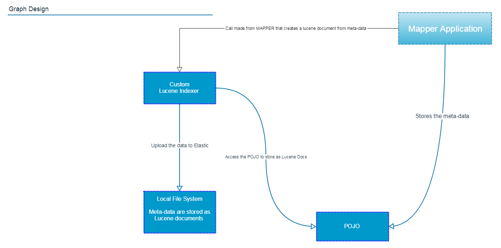
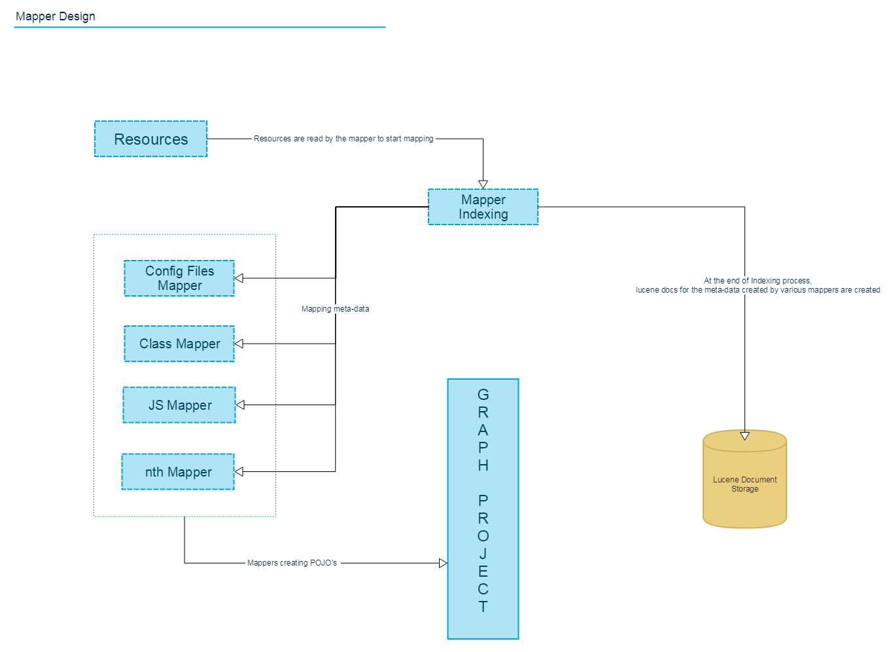

# Hitchhiker's Guide to The Indexa

## Table Of Contents :bookmark_tabs:

* [What is the Indexa?](#what-is-the-indexa)
* [How does the Indexa make your life easier?](#how-does-the-indexa-make-your-life-easier)
    * [Additional Context](#additional-context)
* [Indexa Components](#indexa-components)
    * [Graph](#graph)
    * [Mapper](#mapper)
* [Contributing](#contributing)

***

# What is the Indexa?

The Indexa is a group of projects that work together to analyze and provide dependency data for developers, regarding the dependencies needed by any project which gathers dependencies from a single directory. The Indexa analyzes artifact data (data on jars, wars, and ears) and outputs lucene index data to detail the analysis results, specifically regarding what an artifact uses and which artifacts it is used by.

## Additional Context

Please read our [Dependency Management Primer](./PRIMER.md) for a deeper dive into dependency management concepts and how we came to realize our need for Indexa.

# How does the Indexa make your life easier?

Providing a means of allowing developers to gather dependency/metadata information for the artifacts required by their project empowers them to explicitly declare their own dependencies. This ultimately yields a more stable project by enabling developers to resolve dependencies of that project space in whichever way is most appropriate for that particular codebase, because they will not have to adhere to limitations/restrictions created by any inappropriately coupled project dependencies. The stability achieved by this increased control over project dependencies contributes to decreased outages and greater availability.

# How do I get started?

* Step 1: Setup the [Graph](https://github.com/usaa/indexa/tree/master/indexa-graph) 
* Step 2: Setup the [Mapper](https://github.com/usaa/indexa/tree/master/indexa-mapper)
* Step 3: Run the [Mapper](https://github.com/usaa/indexa/tree/master/indexa-mapper)

# Indexa Components

There are a few components that come together to form Indexa.

The Graph and Mapper projects can be thought of as pieces of the puzzle for dependency management. The diagram below illustrates a potential 
outcome of the use of the graph, along with other components. 

## Graph

### How does the Graph help Indexa?

Various operations performed by the Graph project are outlined below

1. The models/POJO's are used to map the dependency data for resources/artifacts.
    
2. Lucene indexes are created for the data stored in models/POJO's using Lucene IndexWriter.
    
3. Stored lucene-indexes can be converted back to models/POJO's using the provided implementations.

## Mapper 

### How does the Mapper help Indexa?

The Mapper application has a dependency on the Graph application and uses the graph's capabilities to execute the dependency analysis. 

Resources used in the mapper application could be JAR, EAR, WAR, class files, config files. Additionally, nested resources are analyzed by the mapper.

Various operations performed by the Mapper project are outlined below

1. Reads the resources from the user input and indexes the data with a mapper.

2. Uses multiple mapper's to collect the meta-data from the resource(s) file respectively. This functionality is known as 'mapping the meta-data'.

3. Data is collected by the mapper and stored in models/POJO provided by the graph.

4. Lucene documents are created from the models/POJO of the graph project; this function is known as 'indexing the meta-data.'

# Contributing

Please see our [Contribution Guide](../CONTRIBUTING.md) 

